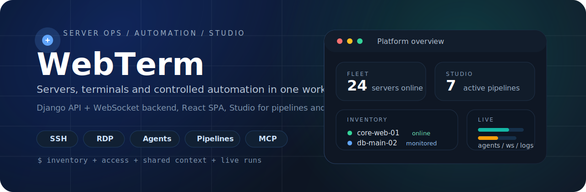
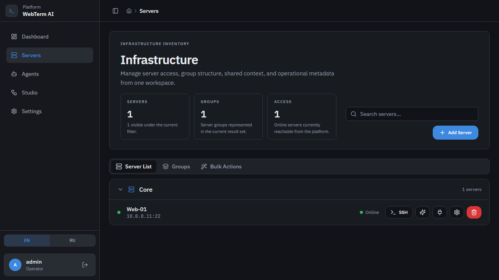
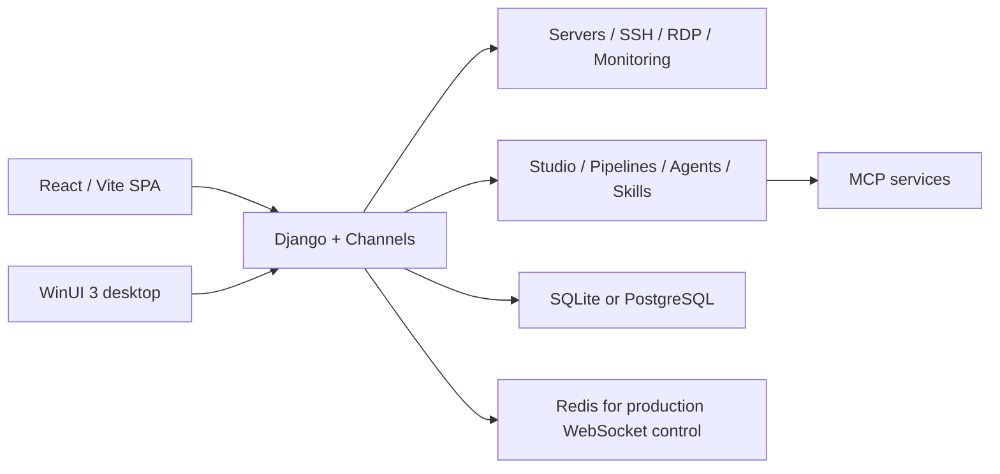

<p align="center">
  
</p>

<h1 align="center">WebTerm</h1>

<p align="center">
  Операционная панель для серверов, терминалов и автоматизации: SSH/RDP, общий инфраструктурный контекст,
  AI-агенты, pipelines, MCP и отдельный desktop-клиент.
</p>

<p align="center">
  
  
  
  
  
  
</p>

> Если по-простому: WebTerm собирает в одном месте то, что в реальной работе обычно размазано по разным вкладкам и блокнотам. Здесь рядом живут список серверов, SSH/RDP-доступ, рабочий контекст по инфраструктуре, AI-запуски, Studio для пайплайнов и MCP-интеграции. Django держит API и WebSocket, React/Vite отвечает за SPA, а WinUI-клиент закрывает desktop-сценарий.

## Как это выглядит

<table>
  <tr>
    <td width="50%">
      
      <p><strong>Servers</strong><br />Инвентарь, группы, быстрые действия, доступы и точка входа в терминал.</p>
    </td>
    <td width="50%">
      
      <p><strong>Studio</strong><br />Пайплайны, агенты, библиотека, MCP registry и уведомления в одном разделе.</p>
    </td>
  </tr>
</table>

## Что внутри

| Блок | Что есть на практике |
| --- | --- |
| Servers | Инвентарь серверов, группы, shares, быстрый execute, knowledge/context, шифрование паролей, bulk update. |
| Terminal | SSH через WebSocket, RDP-сценарии, hub-режим, xterm.js на фронтенде. |
| Monitoring | Health-checks, alerts, dashboard по состоянию инфраструктуры. |
| Agents | AI-агенты по серверам, live-логи, approve-plan flow, редактирование задач по ходу run. |
| Studio | Pipelines, triggers, runs, MCP registry, skills, notifications, assistant для пайплайнов. |
| Access | Сессии, права, группы, auth API, доменная авторизация и desktop API. |
| Desktop | WinUI 3 клиент с WebView2 и отдельным backend API под `api/desktop/v1/`. |

## Основные сценарии

- Держать парк серверов в одном месте: группы, доступы, общий контекст, заметки и быстрые действия без прыжков между разными тулзами.
- Открывать SSH/RDP из веб-интерфейса и сразу работать с тем же сервером в мониторинге, базе знаний и запусках агентов.
- Запускать AI-агентов по серверам, смотреть live-лог выполнения, подтверждать план и дорабатывать шаги без ручной возни.
- Собирать automation pipelines в Studio, привязывать MCP-сервисы, делать webhook/schedule trigger и слать уведомления в Telegram или email.
- Использовать тот же backend из desktop-клиента на Windows, если браузерный сценарий неудобен.

## Архитектура в двух словах



## Быстрый старт

### Что понадобится

- Python 3.10+
- Node.js 20+ и `npm`
- Docker Desktop, если хотите поднять полный стек через compose
- WebView2 Runtime и Windows App SDK, если нужен desktop-клиент

### Важные нюансы до запуска

- Если `POSTGRES_HOST` или `POSTGRES_DB` не заданы, backend автоматически стартует на SQLite. Для первого запуска это нормально.
- `python manage.py runserver` без явного порта сам подставит `9000`.
- Фронтенд по умолчанию живет на `http://127.0.0.1:8080`.
- Для production или multi-worker режима нужен `CHANNEL_REDIS_URL`; `InMemoryChannelLayer` годится только для dev.

### Самый короткий путь на Windows

`bootstrap-config.ps1` только создает локальные конфиги из шаблонов. Установку зависимостей и запуск он не делает.

```powershell
.\bootstrap-config.ps1
python -m venv .venv
.\.venv\Scripts\Activate.ps1
python -m pip install --upgrade pip
pip install -r requirements-mini.txt
python manage.py migrate
python manage.py createsuperuser
python manage.py runserver
```

Во втором терминале:

```powershell
cd ai-server-terminal-main
npm install
npm run dev
```

После этого:

- SPA: `http://127.0.0.1:8080`
- Django health: `http://127.0.0.1:9000/api/health/`
- Django admin: `http://127.0.0.1:9000/admin/`

### Самый короткий путь на Linux/macOS

`bootstrap-linux.sh` уже умеет больше: создать `.env`, поднять docker-сервисы, сделать venv, поставить зависимости, прогнать миграции и при желании установить фронтенд.

```bash
chmod +x ./bootstrap-linux.sh
./bootstrap-linux.sh
```

Если нужен полный набор Python-зависимостей:

```bash
./bootstrap-linux.sh --full
```

Если docker не нужен:

```bash
./bootstrap-linux.sh --no-docker
```

## Запуск через Docker

Если хотите поднять сразу backend, frontend, PostgreSQL, Redis и MCP-сервисы:

```bash
cp .env.example .env
docker compose up -d --build
```

Что поднимется:

| Сервис | Порт | Назначение |
| --- | --- | --- |
| frontend / nginx | `8080` | Публичная точка входа в SPA |
| backend | `9000` | Django API, admin, health, WebSocket backend |
| postgres | `5432` | Основная БД |
| redis | `6379` | Channels / runtime control |
| mcp-demo | `8765` | Демонстрационный MCP HTTP server |
| mcp-keycloak | `8766` | Keycloak MCP server |

Если нужен не весь стек, а только инфраструктура для Studio:

```bash
docker compose -f docker-compose.postgres-mcp.yml up -d
```

## Настройка `.env`

Шаблон лежит в [`.env.example`](./.env.example). Реальные секреты в git не кладем.

Минимум, который имеет смысл проверить руками:

| Переменная | Зачем нужна |
| --- | --- |
| `DJANGO_DEBUG` | Dev/prod режим. Для локалки обычно `true`, для продакшена `false`. |
| `DJANGO_SECRET_KEY` | Обязателен в production, должен быть длинным и случайным. |
| `SITE_URL` | Базовый URL backend и ссылок из уведомлений. |
| `FRONTEND_APP_URL` | URL внешнего SPA, по умолчанию `http://127.0.0.1:8080`. |
| `ALLOWED_HOSTS` | Список допустимых host header. |
| `CSRF_TRUSTED_ORIGINS` | Нужен, если frontend/backend работают не на одном origin. |
| `POSTGRES_*` | Включают PostgreSQL вместо SQLite. |
| `CHANNEL_REDIS_URL` | Обязателен для production и multi-worker WebSocket control. |
| `GEMINI_API_KEY` | LLM-функции платформы. |
| `TELEGRAM_BOT_TOKEN` / `TELEGRAM_CHAT_ID` | Уведомления и подтверждения в Telegram. |
| `EMAIL_*` / `PIPELINE_NOTIFY_EMAIL` | Email-уведомления и письма. |
| `KEYCLOAK_*` | Интеграция с keycloak MCP-профилями. |

Полезная мелочь: для продакшена уже есть готовая заготовка в [`render.yaml`](./render.yaml).

## Ручные команды, которые пригодятся

### Backend

```bash
python manage.py migrate
python manage.py createsuperuser
python manage.py runserver
python manage.py run_monitor
python manage.py load_pipeline_templates
python manage.py run_scheduled_pipelines
```

### Frontend

```bash
cd ai-server-terminal-main
npm install
npm run dev
npm run build
npm run test
npm run test:e2e
```

### Качество

```bash
pytest
ruff check .
ruff format .
```

## Структура репозитория

| Путь | Что там лежит |
| --- | --- |
| [`web_ui/`](./web_ui) | Django settings, root URLs, ASGI/WSGI, общая сборка WebSocket routing |
| [`core_ui/`](./core_ui) | Auth/session API, redirects в SPA, access/settings/admin endpoints, middleware |
| [`servers/`](./servers) | Серверы, группы, SSH/RDP, monitoring, knowledge, server agents |
| [`studio/`](./studio) | Pipelines, runs, MCP registry, triggers, notifications, live updates |
| [`app/`](./app) | Общие LLM/SSH/safety сервисы |
| [`ai-server-terminal-main/`](./ai-server-terminal-main) | Основной React/Vite SPA |
| [`desktop/`](./desktop) | WinUI 3 клиент и solution |
| [`docker/`](./docker) | Dockerfile, nginx config, startup scripts |
| [`tests/`](./tests) | Тесты верхнего уровня |

## Desktop-клиент

Веб-интерфейс здесь основной, но рядом лежит Windows-клиент на WinUI 3. Его backend-точки сидят под `/api/desktop/v1/`.

Быстрый старт для desktop:

```powershell
cd desktop
dotnet restore .\MiniProd.Desktop.sln
dotnet build .\MiniProd.Desktop.sln -c Debug -p:Platform=x64 -m:1 /p:UseSharedCompilation=false /p:BuildInParallel=false
.\src\MiniProd.Desktop\bin\x64\Debug\net8.0-windows10.0.19041.0\MiniProd.Desktop.exe
```

Подробности и оговорки лежат в [`desktop/README.md`](./desktop/README.md).

## Production notes

- При `DJANGO_DEBUG=false` backend требует явный `CHANNEL_REDIS_URL` или `CELERY_BROKER_URL`; без этого приложение специально не стартует.
- `docker/render-backend-start.sh` перед запуском `daphne` делает `migrate` и `collectstatic`, так что схема старта уже выстроена под деплой.
- Если фронтенд и backend живут на разных доменах, проверьте `FRONTEND_APP_URL`, `SITE_URL`, `ALLOWED_HOSTS`, `CSRF_TRUSTED_ORIGINS` и `CROSS_SITE_AUTH`.
- Для Render в репозитории уже есть рабочий blueprint: [`render.yaml`](./render.yaml).

## Что еще важно знать

- Публичная обзорная документация теперь живет здесь, в корневом `README.md`.
- Внутренний технический контекст для агентной работы лежит в [`AGENTS.md`](./AGENTS.md).
- Опасные серверные действия должны проходить через проверки в [`app/tools/safety.py`](./app/tools/safety.py).

## License

Проект распространяется по [MIT License](./LICENSE).
